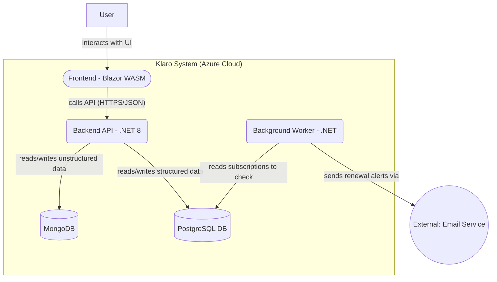

# Klaro - Your Personal Management OS

A personal management application designed to bring clarity and control over daily life, from subscriptions and vehicle maintenance to personal goals and finances. This project is being developed as a practical exercise in building modern, cloud-native applications using .NET and Clean Architecture principles.

---

## MVP Scope: Subscription Management

The initial version of Klaro will focus exclusively on the **Subscription Management** module. The core features for the MVP are:

* **CRUD Operations:** Users can add, view, edit, and delete their subscriptions.
* **Automated Alerts:** A background service will send email notifications 7 days before a subscription is due for renewal.
* **Simple Dashboard:** A clean interface to view all upcoming renewal dates and total monthly/yearly costs.

---

## Technology Stack

* **Backend:** .NET 8, ASP.NET Core (Minimal APIs), Clean Architecture
* **Frontend:** Blazor WebAssembly
* **Databases:** PostgreSQL (for structured data) & MongoDB (for unstructured data like notifications)
* **Containerization:** Docker & Docker Compose
* **Cloud:** Microsoft Azure
* **Authentication:** Auth0 / Microsoft Entra ID

---

## High-Level Architecture

This diagram shows the main components of the system and how they interact.

## Design & Documentation

* **[Use Case Diagram for MVP](docs/1_Use_Case_MVP.md)** - Describes what the application does.
* **[High-Level Architecture](docs/2_Architecture.md)** - Shows how the  is built.
* **[Data Model (ERD)](docs/3_Data_Model.md)** - Defines the database strucsystemture.

## Getting started