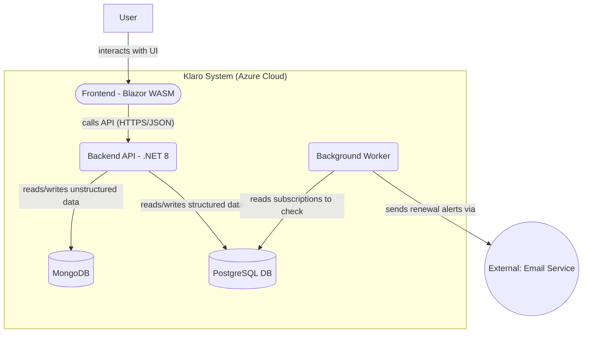

```mermaid
    flowchart TD
        User

        subgraph subgraph0["Klaro System (Azure Cloud)"]
            FE([Frontend - Blazor WASM])
            API(Backend API - .NET 8)
            DB_PG[(PostgreSQL DB)]
            DB_MONGO[(MongoDB)]
            BW(Background Worker)

        end
        
        EmailService((External: Email Service))

        User -- "interacts with UI" --> FE
        FE -- "calls API (HTTPS/JSON)" --> API

        API -- "reads/writes unstructured data" --> DB_MONGO
        API -- "reads/writes structured data" --> DB_PG

        BW -- "reads subscriptions to check" --> DB_PG
        BW -- "sends renewal alerts via" --> EmailService
```    