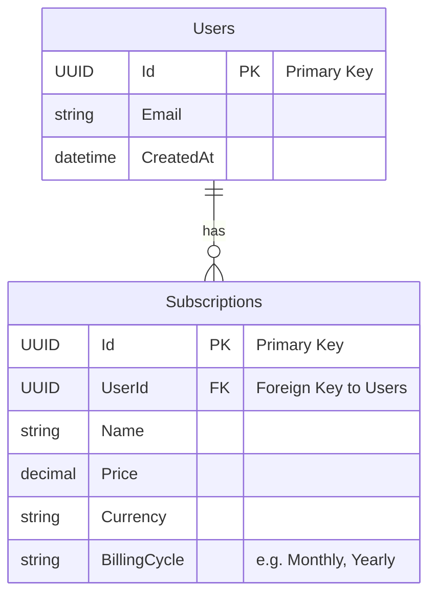

```mermaid
    erDiagram
        Users{
            UUID Id PK "Primary Key"
            string Email
            datetime CreatedAt
        }

        Subscriptions{
            UUID Id PK "Primary Key"
            UUID UserId FK "Foreign Key to Users"
            string Name
            decimal Price
            string Currency
            string BillingCycle "e.g. Monthly, Yearly"
        }

        Users ||--o{ Subscriptions : "has"
```